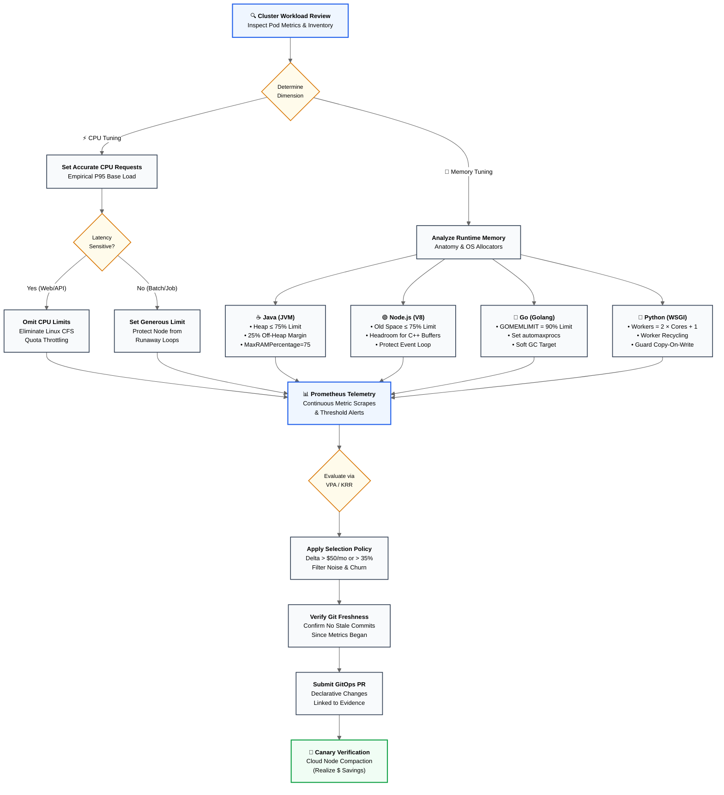

# Enterprise Kubernetes Rightsizing & Resource Optimization Guide

[](https://opensource.org/licenses/Apache-2.0)
[](https://kubernetes.io/)
[](https://www.youtube.com/@nubenetes)
[](https://learnkube.com/kubernetes-rightsizing)

A production-grade, architectural reference repository for optimizing CPU and memory across enterprise Kubernetes and OpenShift fleets. 

This repository contains concrete manifests, runtime-specific tuning configurations (Java/JVM, Node.js, Go, Python), Prometheus diagnostic alerts, Kyverno policies, and AI-assisted GitOps workflows based on empirical kernel telemetry.

> [!IMPORTANT]
> **Disclaimer & Purpose**
> This repository, its documentation, and all accompanying manifests have **not been tested in a real environment** and have been **generated by Gemini 3.8 Flash**.
>
> Its sole purpose is to serve as an **architectural reference guide**, **conceptual framework**, and **educational companion** to *The Technical Guide to Kubernetes Rightsizing* ([LearnKube](https://learnkube.com/kubernetes-rightsizing)) and the [@nubenetes](https://www.youtube.com/@nubenetes) YouTube series. All configurations, scripts, and policies must be thoroughly verified, benchmarked, and reviewed in staging environments before any live cluster deployment.

---

## 📚 Foundational Reference

This project is built directly upon the research, mathematical models, and architectural principles established in **The Technical Guide to Kubernetes Rightsizing** by [LearnKube](https://learnkube.com):

* 🌐 **Official Web Guide & Updates:** [https://learnkube.com/kubernetes-rightsizing](https://learnkube.com/kubernetes-rightsizing)
* 📖 **Official Book (314 Pages):** Available for download directly from the authors at [learnkube.com/kubernetes-rightsizing](https://learnkube.com/kubernetes-rightsizing).

---

## 📺 Video & Shorts Companion Series (@nubenetes)

Watch the complete video breakdown on the [**Nubenetes YouTube Channel**](https://www.youtube.com/@nubenetes):

### 🎬 Long-Form Architecture Breakdowns

| Video Title | Runtime | Topic & Architectural Focus | Watch Link |
| :--- | :--- | :--- | :--- |
| **Why Pods Fail** | 7:35 | Root cause analysis of `OOMKilled` (Exit 137), startup spikes, CFS throttling probe failures, and QoS eviction dynamics. | [Watch Video](https://www.youtube.com/watch?v=ir69ilWvuk8) |
| **K8s AI Rightsizing** | 8:50 | Architecture of AI agents for fleet rightsizing: statistical calculation vs. LLM context synthesis, stale revisions, and rollback signals. | [Watch Video](https://www.youtube.com/watch?v=KNBemmtQjl0) |
| **Optimize K8s Resources** | 9:12 | Complete guide to requests vs. limits, container vs. application memory, Prometheus scrape traps, VPA/KRR algorithms, and cloud cost compaction. | [Watch Video](https://www.youtube.com/watch?v=aUIh_S8u5Z0) |

### 📱 YouTube Shorts (Quick Concepts)

| Short Title | Runtime | Key Concept | Watch Link |
| :--- | :--- | :--- | :--- |
| **Why Kubernetes Rightsizing Breaks Production** | 1:16 | The rightsizing paradox: why applying average p95 recommendations triggers immediate cold start crashes and HPA chaos. | [Watch Short](https://www.youtube.com/shorts/JvLlDvCDaQs) |
| **Why Java Containers Crash in Kubernetes** | 1:10 | Sizing beyond the heap (`-Xmx`): accounting for Metaspace, thread stacks, direct byte buffers, and native libraries. | [Watch Short](https://www.youtube.com/shorts/TALoXBzoP18) |
| **Why AI Optimizers Crash Your Apps** | 1:11 | Why unconstrained AI automation without GitOps guardrails and revision validation fails in production. | [Watch Short](https://www.youtube.com/shorts/sOnNqP4fXA0) |
| **Why You Shouldn't Set CPU Limits** | 1:23 | The Linux CFS Quota trap: how multi-threaded bursts exhaust 100ms quotas, causing massive P99 latency spikes on idle nodes. | [Watch Short](https://www.youtube.com/shorts/WrKVlL6tOS8) |
| **Why Container Memory Isn't Application Memory** | 1:08 | RSS vs. active/inactive page cache, memory allocators (glibc vs. jemalloc), and why freed heap memory stays in cgroups. | [Watch Short](https://www.youtube.com/shorts/Uk3dVmDw1f0) |

---

## 🧠 Core Architecture & Decision Framework



---

<a id="table-of-contents"></a>
## 📖 Table of Contents & Chapter Guide

This repository provides an in-depth, hands-on architectural curriculum for Kubernetes rightsizing. You can read the guides sequentially or jump directly to any topic below:

### 🏛️ Core Architectural Chapters

| Chapter | Title | Architectural Focus & Key Takeaways |
| :---: | :--- | :--- |
| **01** | [**Requests, Limits, and Kernel Mechanics**](docs/01-requests-limits-kernel-mechanics.md) | **Linux CFS Quotas, Shares & OOM Termination:** How Kubernetes requests (`cpu.shares` / `cpu.weight`) and limits (`cpu.cfs_quota_us` / `cpu.max`) map to cgroups v1 & v2. Why setting hard CPU limits causes severe CFS throttling on multi-threaded runtimes on idle nodes, how memory limits invoke the kernel OOM Killer (Signal 9, Exit 137), and how QoS classes (`Guaranteed`, `Burstable`, `BestEffort`) determine pod eviction priority under node pressure. |
| **02** | [**Container vs. Application Memory**](docs/02-container-vs-application-memory.md) | **Memory Anatomy, Allocators & Cold Starts:** Why container memory (`container_memory_working_set_bytes`) diverges from application runtime memory. Analyzes Resident Set Size (RSS), active vs. inactive page cache reclamation, Linux memory allocators (`glibc` ptmalloc arenas vs. `jemalloc`/`mimalloc` memory fragmentation), and why sizing memory without accounting for cold-start JVM/V8 classloading surges triggers instant rolling update crashloops. |
| **03** | [**Collecting Container, Runtime, and Kubernetes Metrics**](docs/03-metrics-telemetry-pitfalls.md) | **Telemetry Stack, Prometheus Traps & Scrape Latency:** Constructing a multi-layer telemetry pipeline across cgroups, runtime APMs, and the K8s control plane. Highlights the 30-second Prometheus scrape trap where transient throttling spikes are hidden, mathematical pitfalls of $\text{p95}$ vs. $\text{p99}$ vs. maxima, PromQL rate calculation windows (`rate` vs `irate`), and real-time CFS throttle counter tracking (`container_cpu_cfs_throttled_periods_total`). |
| **04** | [**From Metrics to a Safe Recommendation (VPA & KRR)**](docs/04-recommendation-models-vpa-krr.md) | **Recommendation Algorithms, Histograms & Sizing Models:** Technical comparison between Robusta KRR (stateless Prometheus PromQL batch queries, `simple` vs `conservative` percentiles) and Kubernetes Vertical Pod Autoscaler (stateful in-cluster Recommender, decaying weighted histograms with 24h half-life, OOMKill bump multiplier, Updater eviction engine, and Mutating Admission Webhook). Plus the autoscaler collision trap between HPA and VPA. |
| **05** | [**Rightsizing at Scale Is a Policy Problem**](docs/05-fleet-scale-policy-gitops.md) | **Fleet Governance, 4-Step Policy & GitOps:** Managing thousands of microservices through four discrete operational policies: (1) Generation Policy (lookback windows & percentile margins), (2) Selection Policy (noise filtering: e.g. delta > $50/mo or > 35%), (3) Execution Policy (GitOps PR generation to source of truth instead of mutating etcd), and (4) Lifecycle Policy (stale commit guardrails & canary rollback signals). Explains the FinOps reality: why reclaiming requests does not reduce cloud bills until node bin-packing and compaction terminate cloud instances. |
| **06** | [**AI-Assisted Rightsizing & Autonomous Operations**](docs/06-ai-assisted-rightsizing.md) | **Autonomous LLM Agents & Deterministic Control:** Designing safe, production-grade AI agents for fleet rightsizing. Combines deterministic mathematical calculators for resource sizing with LLM agents for contextual reasoning (detecting upcoming marketing campaigns, understanding JVM classloading, verifying Git commit timestamps against telemetry observation windows). Outlines canary evaluation criteria, automated rollback triggers (5xx errors, restart spikes), and automated GitOps PR workflows. |

### ⚙️ Runtime-Specific Optimization Guides

| Runtime | Guide | Deep-Dive Scope & Tuning Knobs |
| :---: | :--- | :--- |
| **Java** | [**Java & the JVM in Kubernetes**](docs/runtimes/java-jvm.md) | **Container-Aware JVM Tuning:** Complete memory anatomy of Java containers (`MaxRAMPercentage`, Young/Old heap vs. off-heap allocations). How to calculate safe container memory limits by accounting for Metaspace, thread stacks ($1\text{MB}$ per thread), direct byte buffers (Netty/NIO), and JIT CodeCache, eliminating the fatal mistake of equating `-Xmx` to container limits. |
| **Node.js** | [**Node.js in Kubernetes**](docs/runtimes/nodejs.md) | **V8 Engine Boundaries & Event Loop Safety:** Configuring `--max-old-space-size` to 70–75% of container RAM, leaving essential headroom for native C++ buffers and code space. How to monitor event loop latency (`event_loop_lag`), prevent GC-induced single-thread pauses, and avoid abrupt container `OOMKilled` crashes. |
| **Go** | [**Go (Golang) in Kubernetes**](docs/runtimes/golang.md) | **Soft Memory Ceilings & CFS Core Alignment:** Modern memory tuning with `GOMEMLIMIT` (Go 1.19+ soft memory ceiling set to 90% of limit) to trigger aggressive GC before hitting hard cgroup walls. Enforcing CPU core alignment using `uber-go/automaxprocs` to prevent CFS throttling caused by default host core detection. |
| **Python** | [**Python (FastAPI, Flask, Django) in Kubernetes**](docs/runtimes/python.md) | **Multi-Process Sizing & Copy-On-Write Decay:** The classic `(2 * Cores) + 1` worker trap in containers on large nodes. Sizing worker processes based on private memory budgets, managing Linux Copy-On-Write (COW) page decay caused by Python refcounting, and configuring `--max-requests` with jitter to defeat progressive memory leaks. |

---

## 📂 Repository Structure

```text
kubernetes-rightsizing/
├── README.md                                    # Master documentation & video index
├── LICENSE                                       # Apache 2.0 License
├── docs/
│   ├── 01-requests-limits-kernel-mechanics.md   # Linux CFS, quota periods, shares, OOMKilled, Eviction, QoS
│   ├── 02-container-vs-application-memory.md   # RSS, WorkingSet, PageCache, allocators, cold starts
│   ├── 03-metrics-telemetry-pitfalls.md         # Prometheus scraping 30s traps, p95 vs p99, cgroup metrics
│   ├── 04-recommendation-models-vpa-krr.md      # VPA vs KRR algorithms, decaying histograms, confidence bounds
│   ├── 05-fleet-scale-policy-gitops.md          # 4 policies (Generation, Selection, Execution, Lifecycle), GitOps
│   ├── 06-ai-assisted-rightsizing.md            # AI agents, LLM synthesis vs calculation, stale branch checks
│   └── runtimes/
│       ├── java-jvm.md                          # JVM sizing, container flags, thread stacks, metaspace
│       ├── nodejs.md                            # V8 heap, --max-old-space-size, buffer allocations, event loop
│       ├── golang.md                            # GOMEMLIMIT, GOMAXPROCS, automaxprocs, goroutine stacks
│       └── python.md                            # Gunicorn/Uvicorn worker budgets, copy-on-write, GIL
├── examples/
│   ├── 01-cfs-throttling/                       # Reproduce CFS quota latency spikes vs unthrottled burst
│   │   ├── deployment-throttled.yaml
│   │   ├── deployment-unthrottled.yaml
│   │   └── load-test.sh
│   ├── 02-runtimes/                             # Runtime container configurations (Bad vs Optimal)
│   │   ├── java/                                # Spring Boot JVM with MaxRAMPercentage
│   │   ├── nodejs/                              # Node.js V8 heap limit & event loop tuning
│   │   ├── golang/                              # Go with GOMEMLIMIT and automaxprocs
│   │   └── python/                              # FastAPI/Gunicorn multi-process sizing
│   ├── 03-monitoring/                           # Prometheus alert rules & PromQL cheat-sheet
│   │   ├── prometheus-rules.yaml
│   │   └── promql-cheat-sheet.md
│   ├── 04-recommendations/                      # Robusta KRR config & VPA manifests
│   │   ├── krr-config.yaml
│   │   └── vpa-workload.yaml
│   ├── 05-policies/                             # Kyverno admission control policies
│   │   ├── kyverno-require-requests.yaml
│   │   ├── kyverno-disallow-cpu-limits.yaml
│   │   └── kyverno-guaranteed-qos.yaml
│   └── 06-ai-agent-automation/                  # Autonomous agent workflow & GitOps reconciler
│       ├── agent-workflow.md
│       ├── rightsizing_reconciler.py
│       └── github-action-pr-verification.yaml
└── scripts/
    ├── check-cluster-rightsizing.sh             # Live cluster audit for missing requests, tight limits & OOMs
    └── calculate-jvm-memory.py                  # CLI calculator for JVM container vs heap memory breakdown
```

---

## 🚀 Quickstart & Hands-on Tools

### 1. Audit Your Live Cluster for Rightsizing Risks
Run the automated diagnostic audit script against your current Kubernetes context:
```bash
./scripts/check-cluster-rightsizing.sh
```
This script checks for:
* Containers terminated due to `OOMKilled` in recent history.
* Containers running without CPU or memory requests.
* Workloads configured with tight CPU limits ($\le 500\text{m}$) at high risk of CFS throttling.

### 2. Calculate Safe Container Sizing for Java Apps
Determine exact container limits and recommended `-XX:MaxRAMPercentage` values:
```bash
./scripts/calculate-jvm-memory.py --heap 2048 --threads 200 --metaspace 192 --direct 256
```

### 3. Deploy Production Alerting Rules
Install Prometheus alerting rules for container CPU throttling and approaching memory limits:
```bash
kubectl apply -f examples/03-monitoring/prometheus-rules.yaml
```

### 4. Enforce Fleet Governance with Kyverno
Prevent unconstrained pod scheduling across your cluster:
```bash
kubectl apply -f examples/05-policies/kyverno-require-requests.yaml
```

---

## 🤝 Contributing

Contributions, issues, and feature requests are welcome! Feel free to check the [issues page](https://github.com/nubenetes/kubernetes-rightsizing/issues).

---

## 📜 License

Distributed under the Apache 2.0 License. See [`LICENSE`](LICENSE) for more information.

All technical attribution belongs to the authors of [LearnKube](https://learnkube.com/kubernetes-rightsizing). Visual explainers and architecture patterns provided by [Nubenetes](https://www.youtube.com/@nubenetes).
