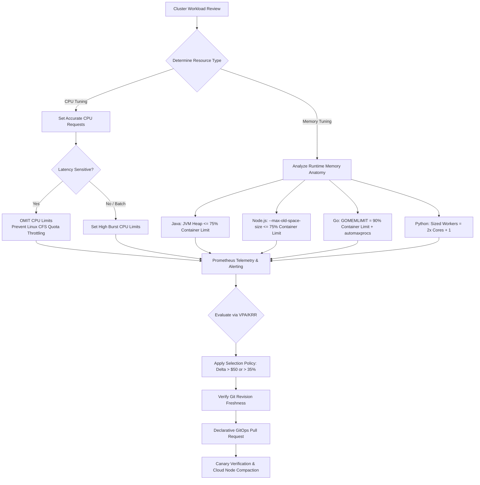

# Enterprise Kubernetes Rightsizing & Resource Optimization Guide

[](https://opensource.org/licenses/Apache-2.0)
[](https://kubernetes.io/)
[](https://www.youtube.com/@nubenetes)
[](https://learnkube.com/kubernetes-rightsizing)

A production-grade, architectural reference repository for optimizing CPU and memory across enterprise Kubernetes and OpenShift fleets. 

This repository contains concrete manifests, runtime-specific tuning configurations (Java/JVM, Node.js, Go, Python), Prometheus diagnostic alerts, Kyverno policies, and AI-assisted GitOps workflows based on empirical kernel telemetry.

> [!IMPORTANT]
> **Disclaimer & Purpose**
> This repository, its documentation, and all accompanying manifests have **not been tested in a real environment** and have been **generated by Gemini 3.8 Flash**.
>
> Its sole purpose is to serve as an **architectural reference guide**, **conceptual framework**, and **educational companion** to *The Technical Guide to Kubernetes Rightsizing* ([LearnKube](https://learnkube.com/kubernetes-rightsizing)) and the [@nubenetes](https://www.youtube.com/@nubenetes) YouTube series. All configurations, scripts, and policies must be thoroughly verified, benchmarked, and reviewed in staging environments before any live cluster deployment.

---

## 📚 Foundational Reference

This project is built directly upon the research, mathematical models, and architectural principles established in **The Technical Guide to Kubernetes Rightsizing** by [LearnKube](https://learnkube.com):

* 🌐 **Official Web Guide & Updates:** [https://learnkube.com/kubernetes-rightsizing](https://learnkube.com/kubernetes-rightsizing)
* 📄 **Comprehensive Book (314 Pages):** Available locally in this repository at [`references/kubernetes-resource-review.pdf`](references/kubernetes-resource-review.pdf).

---

## 📺 Video & Shorts Companion Series (@nubenetes)

Watch the complete video breakdown on the [**Nubenetes YouTube Channel**](https://www.youtube.com/@nubenetes):

### 🎬 Long-Form Architecture Breakdowns

| Video Title | Runtime | Topic & Architectural Focus | Watch Link | Studio Edit Link |
| :--- | :--- | :--- | :--- | :--- |
| **Why Pods Fail** | 7:35 | Root cause analysis of `OOMKilled` (Exit 137), startup spikes, CFS throttling probe failures, and QoS eviction dynamics. | [Watch Video](https://www.youtube.com/watch?v=ir69ilWvuk8) | [Edit in Studio](https://studio.youtube.com/video/ir69ilWvuk8/edit) |
| **K8s AI Rightsizing** | 8:50 | Architecture of AI agents for fleet rightsizing: statistical calculation vs. LLM context synthesis, stale revisions, and rollback signals. | [Watch Video](https://www.youtube.com/watch?v=KNBemmtQjl0) | [Edit in Studio](https://studio.youtube.com/video/KNBemmtQjl0/edit) |
| **Optimize K8s Resources** | 9:12 | Complete guide to requests vs. limits, container vs. application memory, Prometheus scrape traps, VPA/KRR algorithms, and cloud cost compaction. | [Watch Video](https://www.youtube.com/watch?v=aUIh_S8u5Z0) | [Edit in Studio](https://studio.youtube.com/video/aUIh_S8u5Z0/edit) |

### 📱 YouTube Shorts (Quick Concepts)

| Short Title | Runtime | Key Concept | Watch Link | Studio Edit Link |
| :--- | :--- | :--- | :--- | :--- |
| **Why Kubernetes Rightsizing Breaks Production** | 1:16 | The rightsizing paradox: why applying average p95 recommendations triggers immediate cold start crashes and HPA chaos. | [Watch Short](https://www.youtube.com/shorts/JvLlDvCDaQs) | [Edit in Studio](https://studio.youtube.com/video/JvLlDvCDaQs/edit) |
| **Why Java Containers Crash in Kubernetes** | 1:10 | Sizing beyond the heap (`-Xmx`): accounting for Metaspace, thread stacks, direct byte buffers, and native libraries. | [Watch Short](https://www.youtube.com/shorts/TALoXBzoP18) | [Edit in Studio](https://studio.youtube.com/video/TALoXBzoP18/edit) |
| **Why AI Optimizers Crash Your Apps** | 1:11 | Why unconstrained AI automation without GitOps guardrails and revision validation fails in production. | [Watch Short](https://www.youtube.com/shorts/sOnNqP4fXA0) | [Edit in Studio](https://studio.youtube.com/video/sOnNqP4fXA0/edit) |
| **Why You Shouldn't Set CPU Limits** | 1:23 | The Linux CFS Quota trap: how multi-threaded bursts exhaust 100ms quotas, causing massive P99 latency spikes on idle nodes. | [Watch Short](https://www.youtube.com/shorts/WrKVlL6tOS8) | [Edit in Studio](https://studio.youtube.com/video/WrKVlL6tOS8/edit) |
| **Why Container Memory Isn't Application Memory** | 1:08 | RSS vs. active/inactive page cache, memory allocators (glibc vs. jemalloc), and why freed heap memory stays in cgroups. | [Watch Short](https://www.youtube.com/shorts/Uk3dVmDw1f0) | [Edit in Studio](https://studio.youtube.com/video/Uk3dVmDw1f0/edit) |

---

## 🧠 Core Architecture & Decision Framework



---

## 📂 Repository Structure

```text
kubernetes-rightsizing/
├── README.md                                    # Master documentation & video index
├── LICENSE                                       # Apache 2.0 License
├── references/
│   └── kubernetes-resource-review.pdf           # 314-page LearnKube technical guide
├── docs/
│   ├── 01-requests-limits-kernel-mechanics.md   # Linux CFS, quota periods, shares, OOMKilled, Eviction, QoS
│   ├── 02-container-vs-application-memory.md   # RSS, WorkingSet, PageCache, allocators, cold starts
│   ├── 03-metrics-telemetry-pitfalls.md         # Prometheus scraping 30s traps, p95 vs p99, cgroup metrics
│   ├── 04-recommendation-models-vpa-krr.md      # VPA vs KRR algorithms, decaying histograms, confidence bounds
│   ├── 05-fleet-scale-policy-gitops.md          # 4 policies (Generation, Selection, Execution, Lifecycle), GitOps
│   ├── 06-ai-assisted-rightsizing.md            # AI agents, LLM synthesis vs calculation, stale branch checks
│   └── runtimes/
│       ├── java-jvm.md                          # JVM sizing, container flags, thread stacks, metaspace
│       ├── nodejs.md                            # V8 heap, --max-old-space-size, buffer allocations, event loop
│       ├── golang.md                            # GOMEMLIMIT, GOMAXPROCS, automaxprocs, goroutine stacks
│       └── python.md                            # Gunicorn/Uvicorn worker budgets, copy-on-write, GIL
├── examples/
│   ├── 01-cfs-throttling/                       # Reproduce CFS quota latency spikes vs unthrottled burst
│   │   ├── deployment-throttled.yaml
│   │   ├── deployment-unthrottled.yaml
│   │   └── load-test.sh
│   ├── 02-runtimes/                             # Runtime container configurations (Bad vs Optimal)
│   │   ├── java/                                # Spring Boot JVM with MaxRAMPercentage
│   │   ├── nodejs/                              # Node.js V8 heap limit & event loop tuning
│   │   ├── golang/                              # Go with GOMEMLIMIT and automaxprocs
│   │   └── python/                              # FastAPI/Gunicorn multi-process sizing
│   ├── 03-monitoring/                           # Prometheus alert rules & PromQL cheat-sheet
│   │   ├── prometheus-rules.yaml
│   │   └── promql-cheat-sheet.md
│   ├── 04-recommendations/                      # Robusta KRR config & VPA manifests
│   │   ├── krr-config.yaml
│   │   └── vpa-workload.yaml
│   ├── 05-policies/                             # Kyverno admission control policies
│   │   ├── kyverno-require-requests.yaml
│   │   ├── kyverno-disallow-cpu-limits.yaml
│   │   └── kyverno-guaranteed-qos.yaml
│   └── 06-ai-agent-automation/                  # Autonomous agent workflow & GitOps reconciler
│       ├── agent-workflow.md
│       ├── rightsizing_reconciler.py
│       └── github-action-pr-verification.yaml
└── scripts/
    ├── check-cluster-rightsizing.sh             # Live cluster audit for missing requests, tight limits & OOMs
    └── calculate-jvm-memory.py                  # CLI calculator for JVM container vs heap memory breakdown
```

---

## 🚀 Quickstart & Hands-on Tools

### 1. Audit Your Live Cluster for Rightsizing Risks
Run the automated diagnostic audit script against your current Kubernetes context:
```bash
./scripts/check-cluster-rightsizing.sh
```
This script checks for:
* Containers terminated due to `OOMKilled` in recent history.
* Containers running without CPU or memory requests.
* Workloads configured with tight CPU limits ($\le 500\text{m}$) at high risk of CFS throttling.

### 2. Calculate Safe Container Sizing for Java Apps
Determine exact container limits and recommended `-XX:MaxRAMPercentage` values:
```bash
./scripts/calculate-jvm-memory.py --heap 2048 --threads 200 --metaspace 192 --direct 256
```

### 3. Deploy Production Alerting Rules
Install Prometheus alerting rules for container CPU throttling and approaching memory limits:
```bash
kubectl apply -f examples/03-monitoring/prometheus-rules.yaml
```

### 4. Enforce Fleet Governance with Kyverno
Prevent unconstrained pod scheduling across your cluster:
```bash
kubectl apply -f examples/05-policies/kyverno-require-requests.yaml
```

---

## 🤝 Contributing

Contributions, issues, and feature requests are welcome! Feel free to check the [issues page](https://github.com/nubenetes/kubernetes-rightsizing/issues).

---

## 📜 License

Distributed under the Apache 2.0 License. See [`LICENSE`](LICENSE) for more information.

All technical attribution belongs to the authors of [LearnKube](https://learnkube.com/kubernetes-rightsizing). Visual explainers and architecture patterns provided by [Nubenetes](https://www.youtube.com/@nubenetes).
