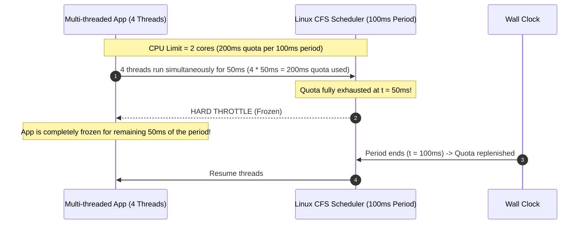
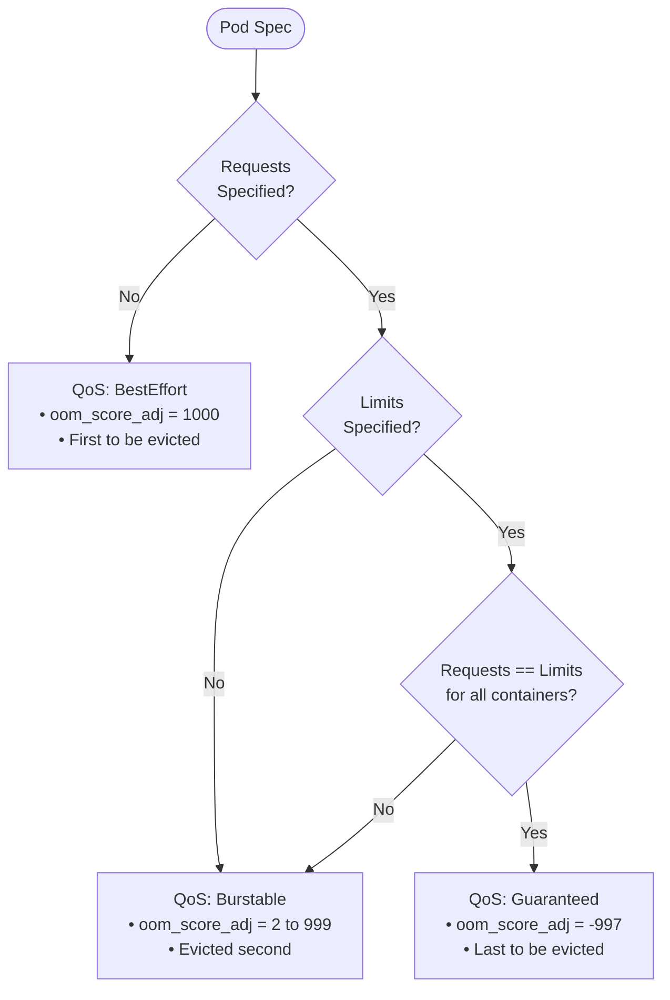

# Chapter 1: Requests, Limits, and Kernel Mechanics

> **Reference:** Companion to Chapter 1 of *The Technical Guide to Kubernetes Rightsizing* ([LearnKube](https://learnkube.com/kubernetes-rightsizing)) and the Nubenetes video [Why Pods Fail](https://www.youtube.com/watch?v=ir69ilWvuk8) & Short [Why You Shouldn't Set CPU Limits](https://www.youtube.com/shorts/WrKVlL6tOS8).

---

## 1. The Disconnect: Intent vs. Kernel Enforcement

In Kubernetes manifests, developers define `resources.requests` and `resources.limits`. While syntactically adjacent, the Linux kernel translates them into entirely distinct control systems within `cgroups` (control groups):

| Concept | Kubernetes Manifest | Linux Kernel cgroup v1 | Linux Kernel cgroup v2 | Action on Exceeding |
| :--- | :--- | :--- | :--- | :--- |
| **CPU Request** | `resources.requests.cpu` | `cpu.shares` | `cpu.weight` | Relative priority weighting under contention |
| **CPU Limit** | `resources.limits.cpu` | `cpu.cfs_quota_us` / `cpu.cfs_period_us` | `cpu.max` | Hard time-slicing throttling |
| **Memory Request** | `resources.requests.memory` | N/A (Scheduler only) | `memory.low` / `memory.min` | Node scheduling reservation |
| **Memory Limit** | `resources.limits.memory` | `memory.limit_in_bytes` | `memory.max` | Immediate termination (`OOMKilled`, code 137) |

---

## 2. CPU Mechanics: Scheduling Shares vs. CFS Quota Throttling

### How CPU Requests Work
A CPU request of `1000m` (1 core) translates to 1024 shares in cgroups. CPU requests **do not throttle** processes. If a node has idle compute cycles, a container requesting `100m` can burst to consume 100% of all available host cores—unless a CPU limit is set.

When the host CPU is saturated (100% utilized), the Linux Completely Fair Scheduler (CFS) allocates execution cycles proportionally to the assigned shares.

### The CFS Quota Trap (Why Setting CPU Limits Causes Latency Spikes)
CPU limits enforce hard execution boundaries over a fixed period window (default: `100ms` or `100,000µs` via `cpu.cfs_period_us`).

$$\text{Quota} = \text{CPU Limit} \times \text{Period}$$

For example, a limit of `200m` equates to `20,000µs` of execution time per `100,000µs` window.

#### Why This Breaks Multi-Threaded Microservices:
1. When a multi-threaded framework (Java JVM, Go, Node.js worker pools) receives a request burst, multiple threads wake up across physical cores.
2. Even if total average CPU is below 15%, the threads consume the 100ms window quota in the first 10-20ms.
3. The kernel places the cgroup on the throttle queue, freezing execution until the next period.
4. **Symptom:** P99 latency degrades by 50-80ms, HTTP timeouts occur, and liveness probes fail—even while host nodes report 70% idle CPU.

---

## 3. Memory Mechanics: Placement vs. OOM Termination

### Memory Requests: Node Allocatable Reservation
The Kubernetes scheduler uses memory requests strictly for scheduling placement against node allocatable capacity:

$$\text{Node Allocatable} = \text{Node Capacity} - \text{Kubelet Reserved} - \text{System Reserved} - \text{Eviction Threshold}$$

Once scheduled, the Linux kernel does not allocate this memory upfront. Memory pages are allocated on demand (anonymous pages, mapped buffers, page cache).

### Memory Limits: The Hard Kernel Wall
When `memory.max` (cgroup v2) or `memory.limit_in_bytes` (cgroup v1) is breached:
1. The kernel attempts immediate page reclamation (dropping clean page caches).
2. If memory remains above the limit, the Linux In-Kernel Out-Of-Memory Killer (`oom_killer`) selects the process with the highest `oom_score` inside the cgroup and sends `SIGKILL` (signal 9).
3. The Kubelet observes container exit status `137` ($128 + 9$) and flags the pod as `OOMKilled`.

---

## 4. Kubernetes Quality of Service (QoS) Classes

Kubernetes derives QoS dynamically from the presence and equality of requests and limits:

### Eviction Order Under Node Pressure
When a worker node falls below its hard eviction threshold (e.g., `memory.available < 100Mi`):
1. **BestEffort pods** are terminated first, regardless of usage.
2. **Burstable pods** that exceed their memory requests are terminated next, ordered by percentage of request exceeded.
3. **Guaranteed pods** are protected and will only be evicted if system daemons or other workloads have already been killed.

---

## 5. Architectural Recommendations

1. **For Latency-Sensitive Web Services:**
   - Configure accurate **CPU Requests** based on empirical p95 load.
   - **Omit CPU Limits** or set high limits with generous burst headroom to prevent CFS throttling.
   - Enforce capacity governance at the Namespace level using `ResourceQuota` rather than artificially constricting pods.
2. **For Memory:**
   - Always set `resources.limits.memory` to prevent runaway memory leaks from destabilizing adjacent workloads on the node.
   - Size memory requests generously to account for startup spikes, class loading, and JIT compilation.
3. **For High-Priority Workloads:**
   - Match `requests.memory == limits.memory` to ensure `Guaranteed` QoS status.
