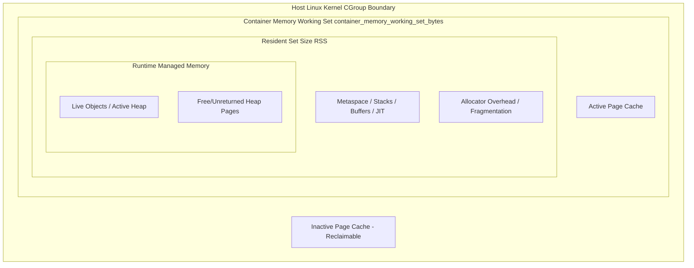

# Chapter 2: Why Container Memory Is Not Application Memory

> **Reference:** Companion to Chapter 2 of *The Technical Guide to Kubernetes Rightsizing* ([LearnKube](https://learnkube.com/kubernetes-rightsizing)) and the Nubenetes Shorts [Why Container Memory Isn't Application Memory](https://www.youtube.com/shorts/Uk3dVmDw1f0) & [Why Java Containers Crash in Kubernetes](https://www.youtube.com/shorts/TALoXBzoP18).

---

## 1. The Observation Paradox

A common frustration among Kubernetes operators:
> *"Our application garbage collector ran and freed 300MB of heap objects, but the container memory graph in Prometheus and Grafana didn't drop a single megabyte!"*

The reason lies in the distinction between how **application runtimes** manage memory and how the **Linux kernel cgroup** accounts for memory pages.

---

## 2. Anatomy of Container Memory

Linux cgroups track memory at the **page level** ($4\text{KB}$ physical memory chunks):

1. **Anonymous Memory (`rss`):**
   - Memory mapped directly by processes that is not backed by a filesystem file (e.g., application heap, execution stacks, thread buffers, internal metadata).
   - This memory **cannot be reclaimed** by the kernel without swapping (and Kubernetes disables swap by default).
2. **Page Cache (`file`):**
   - File-backed pages loaded into memory for I/O operations (reading application assets, logs, libraries).
   - Divided into **Active File** (actively accessed pages) and **Inactive File** (dormant pages the kernel can evict instantly under pressure).
3. **Working Set (`container_memory_working_set_bytes`):**
   $$\text{Working Set} = \text{Total Memory Usage} - \text{Inactive File Cache}$$
   - This is the **exact metric** that Kubernetes monitors to decide whether to trigger OOM kills or node evictions!

---

## 3. Why Freed Memory Stays in Container RSS

When an application deletes an object or runs a garbage collection cycle:
1. **Runtime Heap Reclaim:** The language garbage collector (e.g., JVM G1GC, V8, Go runtime) marks the memory block within its internal heap arena as free for reuse.
2. **OS Memory Allocator:** Memory allocators (such as `glibc` `ptmalloc`, `jemalloc`, or `musl`) manage these pools. Because syscalls like `madvise(MADV_DONTNEED)` or `brk()` are computationally expensive, allocators **retain memory pages** in anticipation of future allocations.
3. **Linux Kernel Perspective:** The physical page table mappings remain valid. To the cgroup accounting subsystem, the container is still holding those physical RAM pages.

---

## 4. Runtime Failure vs. Container OOMKilled

Understanding the fundamental difference between runtime errors and kernel termination:

| Attribute | Runtime Out-Of-Memory Error | Container `OOMKilled` (Exit 137) |
| :--- | :--- | :--- |
| **Origin** | Inside the language runtime (JVM, V8, Python) | Linux Kernel (`oom_killer`) via cgroup subsystem |
| **Trigger** | Heap allocation exceeds language limit (e.g., `-Xmx`) | Working set exceeds `resources.limits.memory` |
| **Process State** | Process remains alive unless uncaught | Process is terminated immediately via `SIGKILL` (9) |
| **Stack Trace** | Generates detailed application stack trace | No application stack trace (process is abruptly silenced) |
| **Kubernetes Status** | `Running` (or app restart via health check) | `OOMKilled` with exit code `137` ($128 + 9$) |

---

## 5. Cold Start Memory Spikes

Applications frequently require significantly more memory during initialization than during steady-state request processing:

```mermaid
gantt
    title Application Memory Lifecycle Over Time
    dateFormat  X
    axisFormat %s s
    section Lifecycle
    JVM / Class Loading / JIT Warmup :active, 0, 45
    Steady-State Request Handling   : 45, 120
    section Memory Demand
    Peak Startup RSS (850 MiB)      :crit, 0, 45
    Steady-State Working Set (420 MiB): 45, 120
```

### The Sizing Trap
If a rightsizing tool (such as VPA or KRR) examines only the steady-state load over a 7-day period, it may recommend a memory limit of `512MiB`. 
When the pod restarts during a rolling update, the initialization surge demands `850MiB` for class loading and bytecode interpretation—causing the pod to be `OOMKilled` before it ever serves its first health check!

---

## 6. Sizing Rules of Thumb

1. **Never equate heap size to container limits.**
   - In Java: Leave 25-35% headroom above `-Xmx` for Metaspace, thread stacks, and native buffers.
   - In Node.js: Ensure container memory is at least 30% higher than `--max-old-space-size`.
   - In Go: Set `GOMEMLIMIT` to approximately 85-90% of the container limit.
2. **Monitor `container_memory_working_set_bytes` rather than application metrics alone.**
3. **Profile application startup** to ensure recommendations incorporate initialization peak RSS.
