# Chapter 3: Collecting Container, Runtime, and Kubernetes Metrics

> **Reference:** Companion to Chapter 3 of *The Technical Guide to Kubernetes Rightsizing* ([LearnKube](https://learnkube.com/kubernetes-rightsizing)) and the Nubenetes video [Optimize K8s Resources](https://www.youtube.com/watch?v=aUIh_S8u5Z0).

---

## 1. The Multi-Layer Observability Stack

Accurate rightsizing requires collecting and cross-referencing telemetry from three distinct layers:

```mermaid
graph TD
    subgraph Layer 1: Linux Kernel & cgroups
        CGroupCPU[container_cpu_usage_seconds_total]
        CGroupThrottle[container_cpu_cfs_throttled_periods_total]
        CGroupMem[container_memory_working_set_bytes]
    end

    subgraph Layer 2: Application Runtime
        JVM[JVM Heap, Metaspace, GC Pause Time]
        NodeMetrics[V8 Heap, Event Loop Lag]
        GoMetrics[Go Alloc, Goroutines, GC CPU Fraction]
    end

    subgraph Layer 3: Kubernetes Control Plane
        KubeState[kube-state-metrics: Replicas, Restarts, Phase]
        KubeLimits[kube_pod_container_resource_requests / limits]
        KubeNode[Node Allocatable, Node Pressure Conditions]
    end

    CGroupCPU --> ReviewRecord[Unified Rightsizing Evidence Record]
    CGroupThrottle --> ReviewRecord
    CGroupMem --> ReviewRecord
    JVM --> ReviewRecord
    NodeMetrics --> ReviewRecord
    GoMetrics --> ReviewRecord
    KubeState --> ReviewRecord
    KubeLimits --> ReviewRecord
    KubeNode --> ReviewRecord
```



---

## 2. Telemetry Pitfalls

### The Prometheus Sampling Rate Trap
Most production clusters scrape metrics every **15 to 30 seconds**.
* Linux CFS quota evaluates execution in **100 millisecond** windows ($0.1\text{s}$).
* A microservice can experience severe CFS quota throttling for 40ms out of every 100ms window throughout a 30-second scrape interval.
* Prometheus averages this out into a modest `rate()`, presenting a calm, 45% CPU utilization graph while end users experience dropped connections and 500ms API lag!

### The p95 vs. Micro-Burst Dilemma
Rightsizing models frequently use the 95th percentile ($\text{p95}$) over a 7-day or 14-day lookback window:
* $\text{p95}$ explicitly discards the top 5% of data as "outliers."
* In a microservice processing periodic batch spikes, daily financial reconciliations, or marketing bursts, the top 5% represents the critical business transactions.
* Trimming requests to match $\text{p95}$ ensures that whenever peak traffic arrives, the service will instantly degrade.

### The Mixed-Revision Hazard
When generating recommendations, telemetry pipelines often query metrics grouped solely by `pod_name` or `container_name`:
* If a new application version was deployed 12 hours ago with improved algorithms or higher memory requirements, querying a 7-day window combines 6.5 days of obsolete code with 12 hours of current code.
* Sizing recommendations must track **revision provenance** (e.g., `git_commit`, `helm.sh/chart`, `app.kubernetes.io/version`).

---

## 3. Essential PromQL Query Reference

### 1. Accurate CPU Core Consumption
```promql
# Real CPU cores consumed per container over 5-minute windows
sum by (namespace, pod, container) (
  rate(container_cpu_usage_seconds_total{container!=""}[5m])
)
```

### 2. CFS CPU Throttling Ratio (Percentage of Time Throttled)
```promql
# Critical metric: percentage of CFS periods throttled
sum by (namespace, pod, container) (
  rate(container_cpu_cfs_throttled_periods_total{container!=""}[5m])
)
/
sum by (namespace, pod, container) (
  rate(container_cpu_cfs_periods_total{container!=""}[5m])
) * 100
```
> **Warning Threshold:** Any throttling ratio $> 15\%$ on latency-critical services requires immediate investigation or removal of CPU limits.

### 3. Memory Working Set vs. Memory Limit Utilization
```promql
# Working set percentage of configured memory limit
sum by (namespace, pod, container) (
  container_memory_working_set_bytes{container!=""}
)
/
sum by (namespace, pod, container) (
  kube_pod_container_resource_limits{resource="memory"}
) * 100
```

### 4. Detecting OOMKilled Containers
```promql
# Detect pods terminated due to OOM in the last 15 minutes
sum by (namespace, pod, container) (
  increase(kube_pod_container_status_terminated_reason{reason="OOMKilled"}[15m])
) > 0
```
