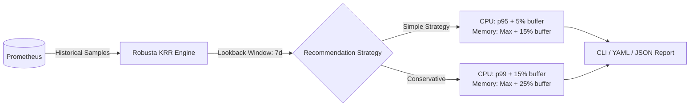
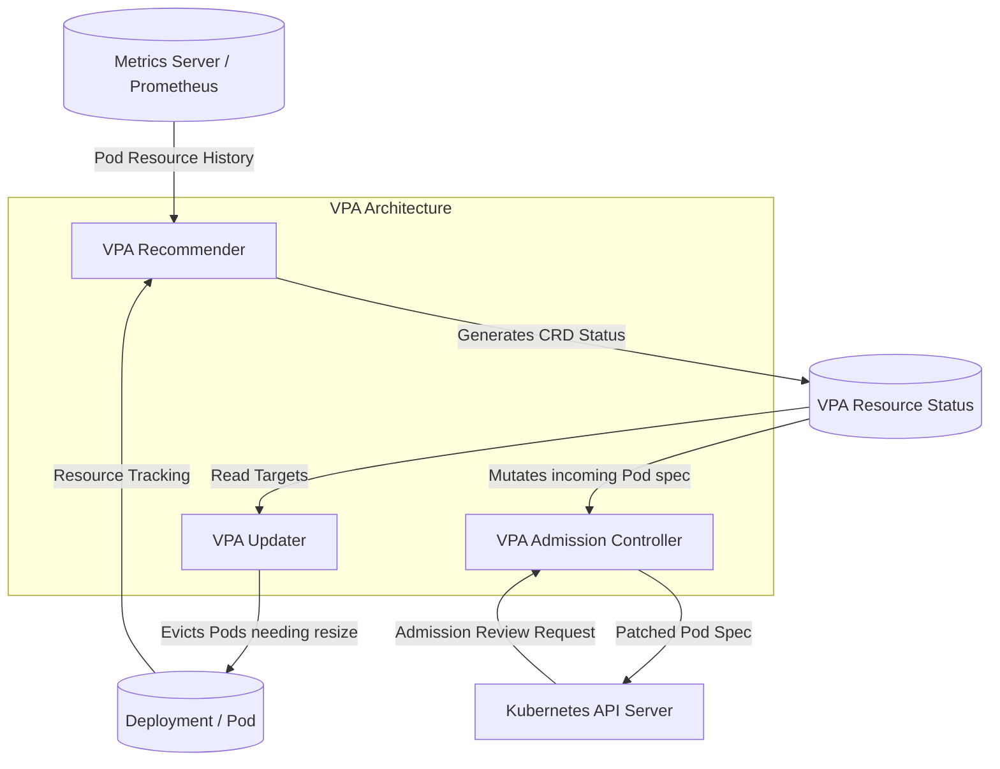

# Chapter 4: From Metrics to a Safe Recommendation (VPA & KRR)

> **Reference:** Companion to Chapter 4 of *The Technical Guide to Kubernetes Rightsizing* ([LearnKube](https://learnkube.com/kubernetes-rightsizing)) and the Nubenetes video [Optimize K8s Resources](https://www.youtube.com/watch?v=aUIh_S8u5Z0).

---

## 1. Comparing Recommendation Engines: KRR vs. VPA

Two major open-source tools dominate Kubernetes recommendation workflows: **Robusta KRR (Kubernetes Resource Recommender)** and the official **Kubernetes Vertical Pod Autoscaler (VPA)**.

| Feature | Robusta KRR | Kubernetes VPA |
| :--- | :--- | :--- |
| **Architecture** | CLI tool or scheduled batch job querying Prometheus | In-cluster control plane controllers (Recommender, Updater, Webhook) |
| **Calculation Model** | Direct PromQL statistical aggregations (percentiles & maxima) | Decaying weighted histograms with continuous decay factor |
| **CPU Strategy** | Default: $\text{p95}$ or $\text{p99}$ of CPU usage over lookback window | Target, LowerBound, and UpperBound derived from percentile distributions |
| **Memory Strategy** | Default: Maximum observed working set + safety buffer (e.g. 15%) | Maximum observed usage with exponential decay and OOM bump factor |
| **Execution Mode** | Informational reports (CLI, Slack, Markdown, YAML) | `Off` (Recommendation only), `Initial` (at pod creation), `Auto` (in-place eviction) |
| **Resource Impact** | Stateless; runs externally against Prometheus | Stateful; maintains memory checkpoints across cluster restarts |

---

## 2. Robusta KRR Mechanics

Robusta KRR operates by executing parameterized PromQL queries directly against Prometheus:



### The Formula:
* **Recommended CPU Request:**
  $$\text{CPU}_{\text{rec}} = \max\left(\text{quantile}(0.95, \text{container\_cpu\_usage}[7\text{d}]), \text{min\_cpu}\right) \times (1 + \text{buffer})$$
* **Recommended Memory Request:**
  $$\text{Mem}_{\text{rec}} = \max(\text{container\_memory\_working\_set}[7\text{d}]) \times (1 + \text{buffer})$$

---

## 3. Kubernetes Vertical Pod Autoscaler (VPA) Architecture

VPA splits its responsibilities across three decoupled controllers:



### VPA's Decaying Histogram Model
Unlike KRR, which queries raw metrics on demand, the VPA Recommender constructs internal **decaying histograms**:
* Histograms use exponentially growing buckets to represent CPU and memory values.
* Weights decay over time using a half-life factor (default: 24 hours), prioritizing recent behavior over historical behavior.
* **OOM Event Bump:** When a pod suffers an OOMKill, VPA immediately detects the event and artificially inflates the memory recommendation by a minimum factor (default: $+15\%$ to $+25\%$).

---

## 4. The Blind Spot of Both Models

Neither KRR nor VPA can infer application-level context:

1. **Scheduled Marketing Campaigns:** An engine observing a quiet Monday-through-Thursday has no awareness of a 10x traffic spike launching on Black Friday.
2. **Cold Initialization Spikes:** Neither model distinguishes between transient JVM classloading memory and genuine runtime request consumption.
3. **Autoscaler Conflicts (HPA vs. VPA):** If an HPA scales on CPU utilization percentage (e.g. 70%), lowering the CPU request concurrently increases the calculated utilization percentage, triggering unwanted HPA replica scale-outs!

---

## 5. Safe Operating Modes

* **Always start in `Off` / Recommendation-Only mode:** Never deploy VPA in `Auto` mode on production workloads without strict bounds.
* **Define `minAllowed` and `maxAllowed` constraints:**
  ```yaml
  resourcePolicy:
    containerPolicies:
      - containerName: app
        minAllowed:
          cpu: 250m
          memory: 512Mi
        maxAllowed:
          cpu: 4000m
          memory: 4Gi
  ```
* **Filter out ephemeral jobs:** Exclude batch jobs, CI/CD runners, and short-lived pods from fleet-wide analysis.
