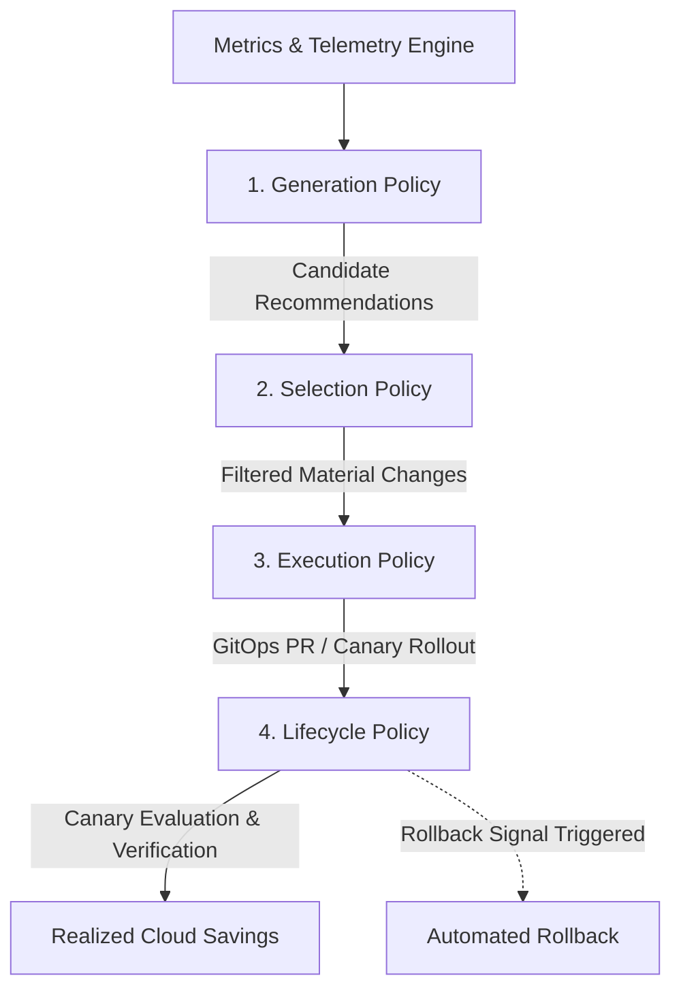
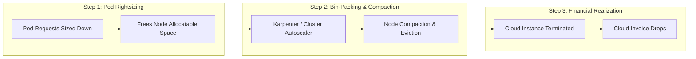
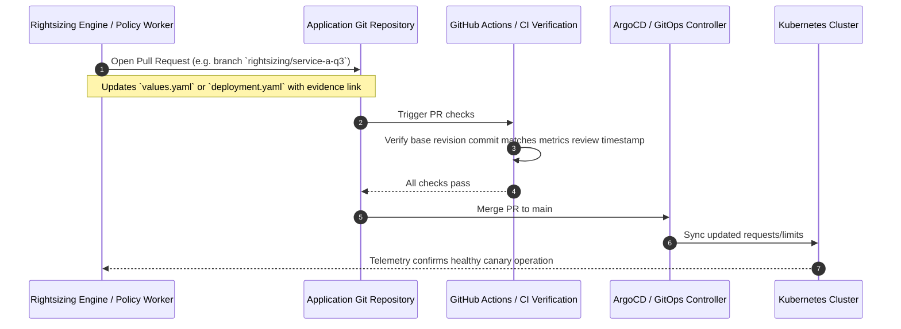

# Chapter 5: Rightsizing at Scale Is a Policy Problem

> **Reference:** Companion to Chapter 5 of *The Technical Guide to Kubernetes Rightsizing* ([LearnKube](https://learnkube.com/kubernetes-rightsizing)) and the Nubenetes video [Optimize K8s Resources](https://www.youtube.com/watch?v=aUIh_S8u5Z0).

---

| ⬅️ Previous | 🏠 Overview | Next ➡️ |
| :--- | :---: | ---: |
| [⬅️ Chapter 4: Recommendation Models (VPA & KRR)](04-recommendation-models-vpa-krr.md) | [📚 Table of Contents](../README.md#table-of-contents) | [Chapter 6: AI-Assisted Rightsizing ➡️](06-ai-assisted-rightsizing.md) |

---

## 1. Moving from Candidates to Fleet Policy

Generating numbers is trivial; applying them safely across thousands of microservices across hundreds of repositories is where rightsizing initiatives succeed or fail.

A rightsizing report containing 2,500 candidate changes is unworkable. Fleet optimization requires decomposing the problem into **Four Discrete Policies**:

### The Four Policies Explained:

1. **Generation Policy:**
   - Defines the lookback window (e.g., 14 days), percentile choices, safety buffers, and runtime-specific overhead rules.
2. **Selection Policy (Noise Reduction):**
   - Filters out minor changes that do not warrant a code review or deployment risk.
   - Example Rule: Only generate an action item if estimated monthly delta $> \$50$ OR CPU request change $> 35\%$.
3. **Execution Policy (Governance & Ownership):**
   - Maps each Kubernetes workload back to its Source of Truth (Git repository, Helm chart, Kustomize overlay) and designated engineering owner.
   - Generates GitOps pull requests rather than blindly mutating live etcd state.
4. **Lifecycle Policy (Safety & Rollback):**
   - Rejects pull requests if the underlying source code or deployment revision changed since the evidence was gathered.
   - Establishes canary verification rules (e.g., monitor HTTP 5xx errors and pod restarts for 60 minutes post-merge).

---

## 2. The Illusion of Savings: Requests vs. Cloud Bills

A critical realization for FinOps and platform engineering teams:
$$\textbf{Reclaiming Pod Requests} \neq \textbf{Immediate Cloud Savings}$$

### The Three Phases of Capital Recovery:
1. **Request Opportunity:** The theoretical amount of CPU and memory freed inside YAML manifests.
2. **Reclaimable Capacity:** Headroom available on worker nodes that cannot be converted to cash until workloads are consolidated.
3. **Realizable Savings:** Actual compute nodes terminated through Karpenter or Kubernetes Cluster Autoscaler.

If a cluster runs 50 underutilized nodes and rightsizing reduces memory across all pods by 25%, but every node still hosts at least two pods, **the cloud provider bill does not decrease by a single dollar** until compaction actively condenses pods onto fewer nodes and terminates the empties!

---

## 3. GitOps Automation Architecture

To maintain documentation integrity and auditability, rightsizing must follow declarative GitOps workflows:

---

| ⬅️ Previous | 🏠 Overview | Next ➡️ |
| :--- | :---: | ---: |
| [⬅️ Chapter 4: Recommendation Models (VPA & KRR)](04-recommendation-models-vpa-krr.md) | [📚 Table of Contents](../README.md#table-of-contents) | [Chapter 6: AI-Assisted Rightsizing ➡️](06-ai-assisted-rightsizing.md) |
