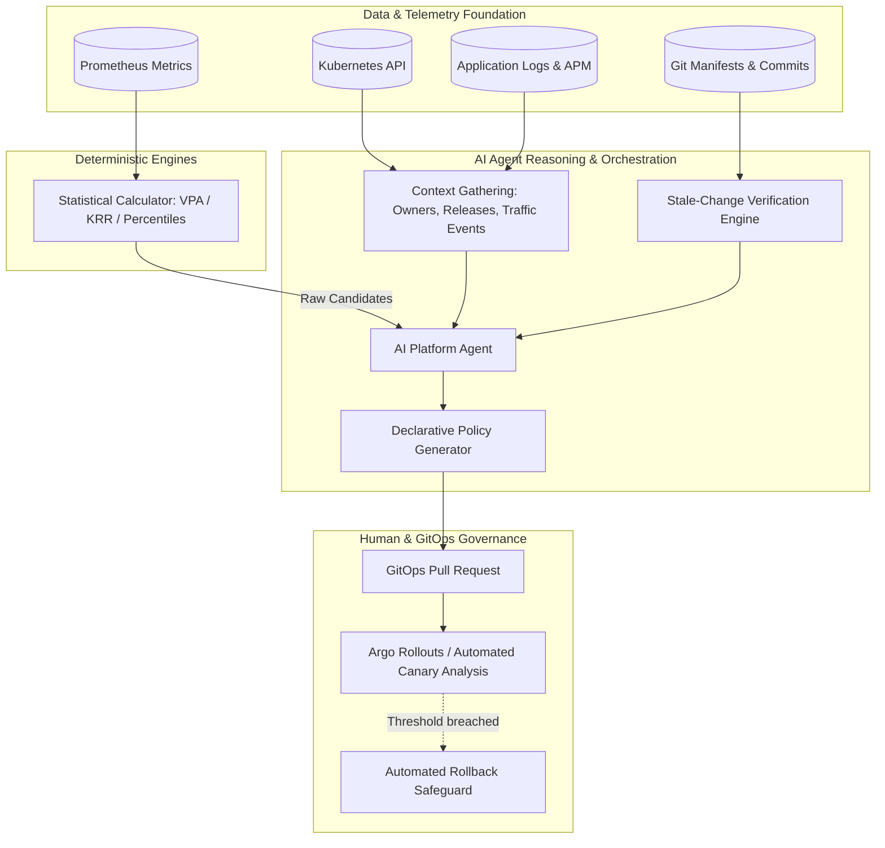

# Chapter 6: AI-Assisted Rightsizing & Autonomous Operations

> **Reference:** Companion to Chapter 6 of *The Technical Guide to Kubernetes Rightsizing* ([LearnKube](https://learnkube.com/kubernetes-rightsizing)) and the Nubenetes video [K8s AI Rightsizing](https://www.youtube.com/watch?v=KNBemmtQjl0) & Short [Why AI Optimizers Crash Your Apps](https://www.youtube.com/shorts/sOnNqP4fXA0).

---

## 1. Can AI Optimize Kubernetes for You?

The short answer is **yes, but not by letting an LLM blindly guess numbers or directly patch live production clusters.**

The optimal operating model pairs **deterministic statistical engines** for numeric calculation with **autonomous LLM agents** for evidence synthesis, context discovery, and GitOps orchestration.

---

## 2. Division of Labor: What Models Do Best

| Task | Deterministic Algorithms (VPA/KRR) | LLM Agents (Generative AI) |
| :--- | :--- | :--- |
| **Numeric Calculation** | ✅ **Exceptional:** Fast, exact math on millions of metric points | ❌ **Poor:** Prone to hallucinating numbers and arithmetic drift |
| **Evidence Synthesis** | ❌ **Cannot do:** Cannot correlate metric drops with git commits | ✅ **Exceptional:** Joins APM logs, PR descriptions, and telemetry |
| **Missing Context Analysis** | ❌ **Cannot do:** Ignorant of upcoming marketing events or refactors | ✅ **Exceptional:** Reads team roadmaps, alerts, and issue trackers |
| **Policy Formulation** | ❌ **Cannot do:** Fixed code only | ✅ **Exceptional:** Writes Kyverno, OPA, and GitOps YAML manifests |
| **Deterministic Guardrails** | ✅ **Essential:** Enforces hard boundary checks (`minAllowed`, `maxAllowed`) | ❌ **Cannot replace:** Must always be constrained by hard rules |

---

## 3. The Three Golden Rules for AI in Production

### Rule 1: Authority Must Grow Slower than Capability
Never grant an AI agent direct write access to cluster `etcd` or live deployments. All recommendations must be codified as **declarative Pull Requests** against Git repositories.

### Rule 2: Enforce Stale-Change Verification
Before proposing a change, the agent must verify:
$$\text{Timestamp}(\text{Latest Git Commit on Manifest}) < \text{Start Time}(\text{Telemetry Observation Window})$$
If a developer updated the service's code or dependencies during the metrics collection period, the statistical evidence is invalid.

### Rule 3: Deterministic Rollback Conditions
Every automated rollout must be tethered to deterministic monitoring signals:
* **Error Rate Spike:** HTTP $5\text{xx} > 0.1\%$ over baseline.
* **Latency Increase:** P99 latency degrades by $> 20\%$.
* **Restart Activity:** Any container restart within 30 minutes of deployment triggers an immediate automated Git revert.
