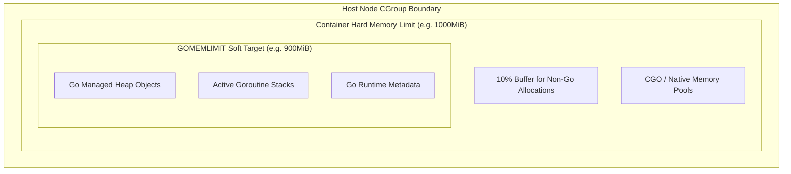

# Runtime Guide: Go (Golang) in Kubernetes

> **Reference:** Companion to Appendix C of *The Technical Guide to Kubernetes Rightsizing* ([LearnKube](https://learnkube.com/kubernetes-rightsizing)).

---

| ⬅️ Previous | 🏠 Overview | Next ➡️ |
| :--- | :---: | ---: |
| [⬅️ Runtime Guide: Node.js](nodejs.md) | [📚 Table of Contents](../../README.md#table-of-contents) | [Runtime Guide: Python ➡️](python.md) |

---

## 1. Go Runtime Memory Architecture

Prior to Go 1.19, the Go garbage collector operated purely on a relative ratio (`GOGC=100`, which triggers GC whenever heap size doubles). In container environments with fixed limits, this caused sudden OOMKills under heavy load spikes.

### The Modern Standard: `GOMEMLIMIT` (Go 1.19+)
`GOMEMLIMIT` establishes a **soft memory target** that instructs the Go garbage collector to run aggressively when total memory approaches the configured ceiling, actively preventing the container from reaching its hard cgroup limit.



### Recommended Setting:
Set `GOMEMLIMIT` to **85% to 90%** of the Kubernetes container memory limit.

```yaml
env:
  - name: GOMEMLIMIT
    value: "900MiB"
resources:
  requests:
    cpu: "500m"
    memory: "512Mi"
  limits:
    memory: "1000Mi"
```

---

## 2. Go Concurrency & `GOMAXPROCS`

By default, the Go runtime executes `runtime.NumCPU()` at startup to set `GOMAXPROCS`.
* On a 64-core Kubernetes node, Go will set `GOMAXPROCS=64`, spawning 64 OS execution threads for scheduler `M` structures.
* If the container CPU limit is set to `2000m` (2 cores), 64 active threads competing for 2 cores will saturate the 100ms CFS quota in under 4ms!

### The Solution: `automaxprocs`
Integrate Uber's battle-tested `automaxprocs` package into your Go microservices:

```go
package main

import (
    "log"
    _ "go.uber.org/automaxprocs"
)

func main() {
    log.Println("Go microservice initialized with container-aware GOMAXPROCS")
}
```
`automaxprocs` automatically inspects the container's cgroup CPU quota and dynamically adjusts `runtime.GOMAXPROCS()` to match your Kubernetes allocation.

---

| ⬅️ Previous | 🏠 Overview | Next ➡️ |
| :--- | :---: | ---: |
| [⬅️ Runtime Guide: Node.js](nodejs.md) | [📚 Table of Contents](../../README.md#table-of-contents) | [Runtime Guide: Python ➡️](python.md) |
