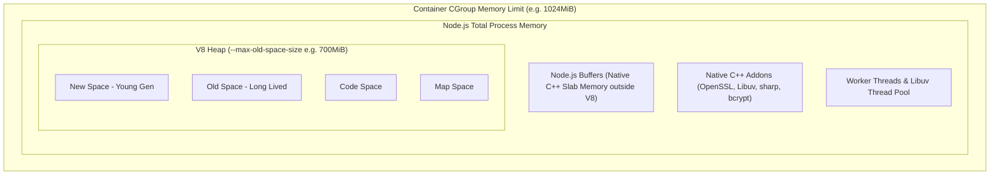

# Runtime Guide: Node.js in Kubernetes

> **Reference:** Companion to Appendix B of *The Technical Guide to Kubernetes Rightsizing* ([LearnKube](https://learnkube.com/kubernetes-rightsizing)).

---

| ⬅️ Previous | 🏠 Overview | Next ➡️ |
| :--- | :---: | ---: |
| [⬅️ Runtime Guide: Java & JVM](java-jvm.md) | [📚 Table of Contents](../../README.md#table-of-contents) | [Runtime Guide: Go (Golang) ➡️](golang.md) |

---

## 1. Node.js & V8 Memory Boundaries

Node.js executes on the Google V8 engine. By default, V8 configures its maximum heap based on available host memory, which inside a container often leads to over-allocation and sudden `OOMKilled` termination.



### The Node Buffer Trap:
`Buffer.alloc()` and `Buffer.from()` allocate memory **outside the V8 heap** in native C++ memory pools. If an application streams large file uploads or handles high-throughput WebSockets, V8 heap usage will appear low in application APMs while container memory rapidly breaches the Kubernetes limit!

---

## 2. Recommended Sizing Formula

Always configure `--max-old-space-size` to approximately **70-75%** of the Kubernetes container limit:

```bash
# For a container with resources.limits.memory: 1024Mi
node --max-old-space-size=768 server.js
```

### In Kubernetes Manifests:
```yaml
env:
  - name: NODE_OPTIONS
    value: "--max-old-space-size=768"
resources:
  requests:
    cpu: "250m"
    memory: "512Mi"
  limits:
    memory: "1024Mi"
    # CPU limit intentionally omitted to prevent Event Loop freezing
```

---

## 3. CPU Limits and the Single-Threaded Event Loop

Node.js executes application JavaScript on a **single-threaded Event Loop**.

### Why CFS CPU Limits Are Dangerous for Node.js:
When Node.js handles a sudden burst of I/O or JSON serialization across incoming requests, setting a fractional CPU limit (e.g. `cpu: 500m`) causes the Linux kernel to throttle the single event loop thread for the remainder of the 100ms CFS period.

During this throttle period:
* The event loop stops ticking entirely.
* Inbound TCP socket connections queue up.
* Event loop lag climbs from `< 5ms` to `> 90ms`.
* Readiness probe checks fail with HTTP 504.

---

| ⬅️ Previous | 🏠 Overview | Next ➡️ |
| :--- | :---: | ---: |
| [⬅️ Runtime Guide: Java & JVM](java-jvm.md) | [📚 Table of Contents](../../README.md#table-of-contents) | [Runtime Guide: Go (Golang) ➡️](golang.md) |
