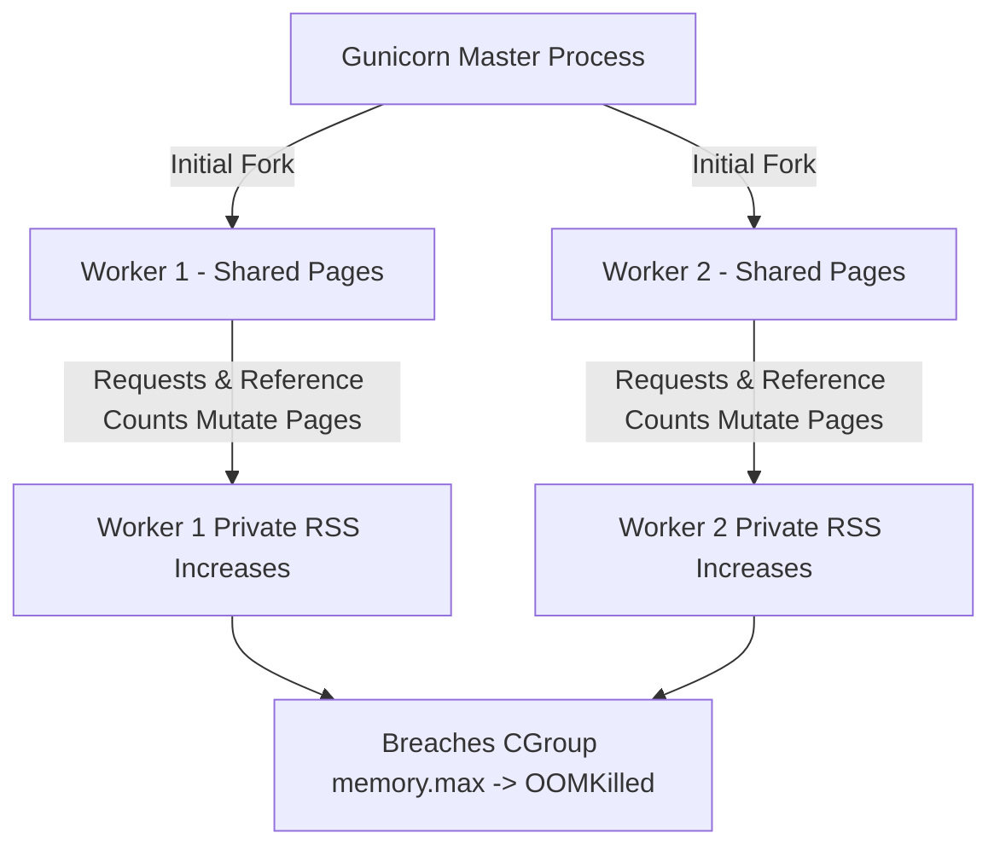

# Runtime Guide: Python (FastAPI, Flask, Django) in Kubernetes

> **Reference:** Companion to Appendix D of *The Technical Guide to Kubernetes Rightsizing* ([LearnKube](https://learnkube.com/kubernetes-rightsizing)).

---

## 1. Multi-Process Architecture & The Worker Sizing Trap

Because standard CPython employs a Global Interpreter Lock (GIL), production web servers (such as Gunicorn or Uvicorn) spawn **multiple worker processes** to utilize CPU capacity.

### The Classic Formula That Breaks Containers:
Documentation for web servers often suggests:
$$\text{Workers} = (2 \times \text{CPU Cores}) + 1$$

If run inside a container on a 32-core node without explicit limits, Gunicorn will launch $65$ worker processes!
Each worker process consumes independent baseline memory ($80\text{MB} - 150\text{MB}$), rapidly exhausting container RAM and triggering an instant `OOMKilled` event.

---

## 2. Copy-On-Write (COW) Memory Decay

When Gunicorn forks worker processes after loading the application master:
1. Initially, worker processes share read-only memory pages with the master process via Linux Copy-On-Write.
2. As requests arrive, Python's internal memory management (such as object reference counting and GC tracking structures) mutates page metadata.
3. The kernel forces a copy of each modified page into private memory.
4. **Result:** Memory consumption per worker gradually climbs over time until the container limit is breached.



---

## 3. Best Practice Sizing Rules for Python

1. **Size Workers to Allocated Container CPU, Not Node CPU:**
   ```bash
   # For a container allocated 2 cores (cpu: "2000m")
   gunicorn app:app --workers=4 --threads=2 --worker-class=gthread
   ```
2. **Mitigate Memory Leaks with Max Requests:**
   Configure periodic worker recycling to release accumulated fragmented memory:
   ```bash
   gunicorn app:app --max-requests=2000 --max-requests-jitter=200
   ```
3. **Use Memory Profilers (tracemalloc / pympler) to Track Native vs Heap Memory:**
   Native C extensions (e.g. `numpy`, `pandas`, `cryptography`) allocate directly via `malloc()` and bypass Python's memory pool.
