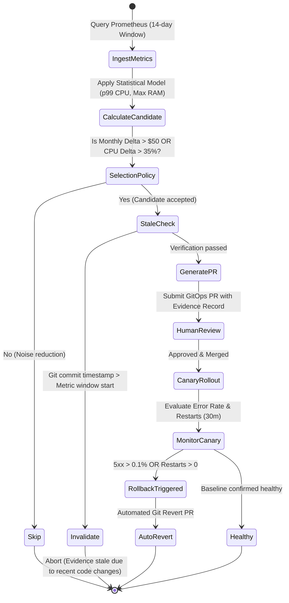

# Autonomous Rightsizing Agent Workflow

## Agent Invariants & Guardrails
1. **Never patch live cluster resources directly:** The agent must only interact via Git Pull Requests.
2. **Never overwrite manual engineer overrides:** Respect `@rightsizing: ignore` annotations.
3. **Always attach evidence provenance:** Every PR must cite the query, lookback window, and reference guide.
